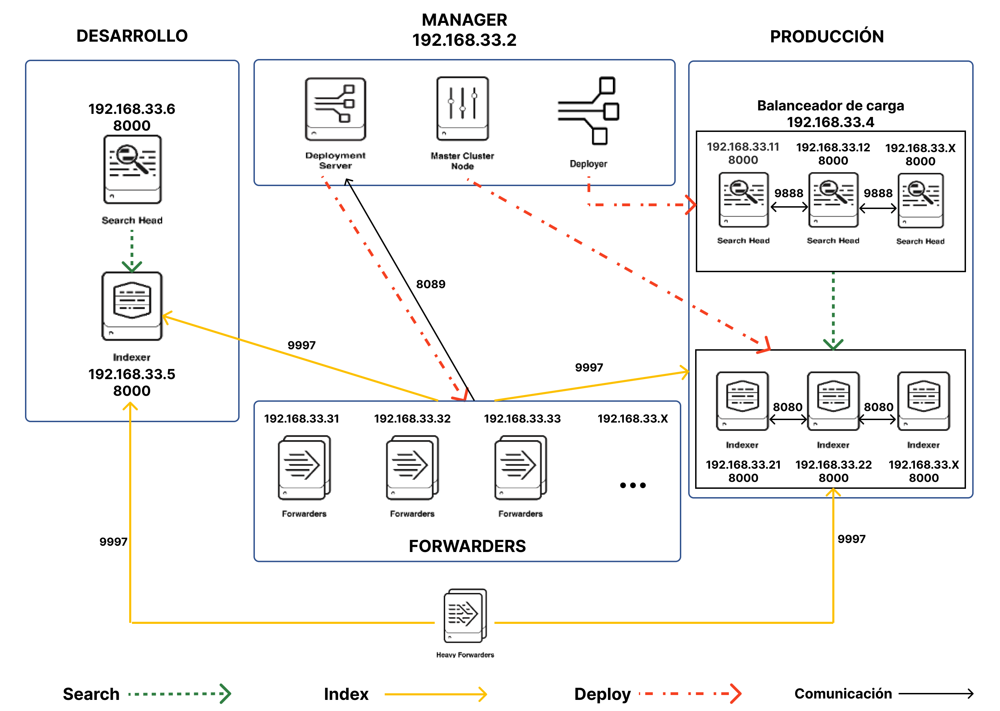
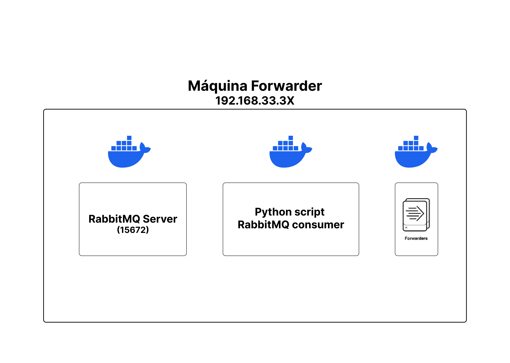
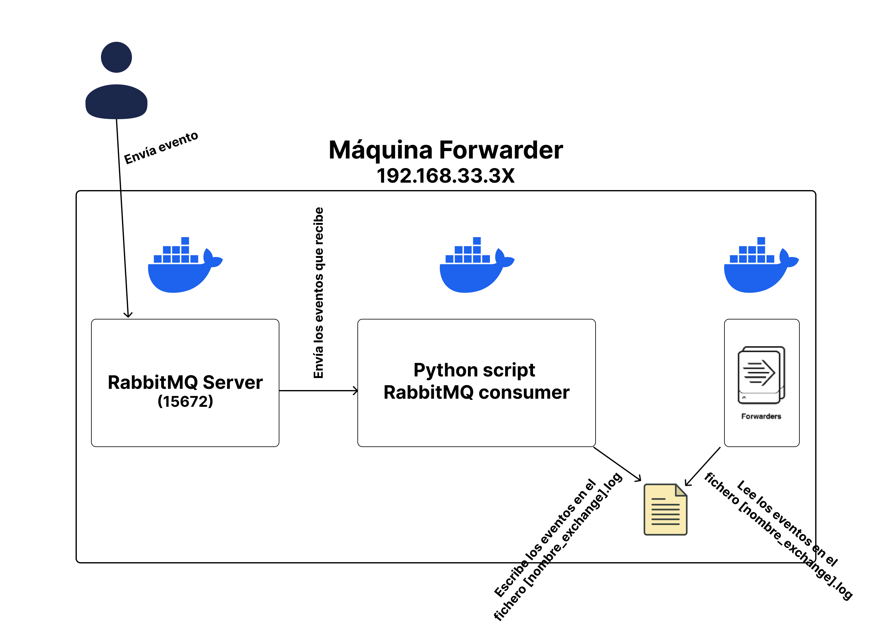

# Splunk Distributed Architecture

## Requisitos

+ Tener instalado [Vagrant](https://www.vagrantup.com/) ([instrucciones](https://developer.hashicorp.com/vagrant/tutorials/getting-started/getting-started-install?product_intent=vagrant)).
+ Instalar el provider de Docker Compose para Vagrant.

  ``` bash
  vagrant plugin install vagrant-docker-compose
  ```

## Diseño arquitectura

### Arquitectura general



### Arquitectura universal forwarders



## Uso

### Añadir indexador al cluster de indexadores de producción

Para añadir un indexador al cluster de indexadores de producción debemos modificar el fichero `indexers.txt` que esta presente en la carpeta `files` dentro de la carpeta `common`. Deberemos añadir a este fichero una línea por cada indexador que queramos añadir al cluster. Este línea debe contener exclusivamente la IP del servidor que debe contener el indexador, precedida por `:`.

### Añadir miembro al cluster de search heads de producción

Para añadir un search head al cluster de search heads de producción debemos modificar el fichero `shcluster_members.txt` que esta presente en la carpeta `files` dentro de la carpeta `common`. Deberemos añadir a este fichero una línea por cada search head que queramos añadir al cluster. Este línea debe contener exclusivamente la IP del servidor que debe contener el search head, precedida por `:`.

### Indexar eventos con usando el servidor RabbitMQ de los forwarders

#### Diagrama



#### Explicación

Para enviar eventos al servidor RabbitMQ de los forwarders tenemos dos opciones:

+ Enviar eventos manualmente a el servidor RabbitMQ. Cuando digo "manualmente" me refiero usando cURL, un script custom, cualquier software, ...

+ Utilizar el script que se proporciona en este repositorio. Este script esta en la carpeta `rabbitmq` dentro de la carpeta `scripts`, dentro de la carpeta `universal-forwarder`. Antes de ejecutar este script debemos cumplir los siguientes requisitos:
  + Tener instalado en Python 3.
  + Instalar las librerías utilizadas. Para instalar las librerías debemos ejecutar `pip install -r requirements.txt`. Podemos instalar estas librerías y usar la version de Python 3 que tengamos instalada de manera global en el ordenador o crear un entorno virtual. La forma recomendad es crear un entorno virtual. Para crear un entorno virtual en Python podemos utilizar **virtualenv** ([Documentación](https://virtualenv.pypa.io/en/latest/index.html)).

  *Nota: Si se utiliza un entorno virtual, antes de lanzar el comando para ejecutar el script, habrá que activarlo.*

  Una vez cumplidos los requisitos para ejecutar el script simplemente debemos invocarlo con el comando `python send.py`. Al lanzar el comando, el script nos pregunta la `exchange` a la que queremos enviar el mensaje y el propio mensaje que queremos enviar. Si le damos enter a cualquiera de las dos pregunta se aplicaran el valor por defecto para la `exchange` (`my_exchange`) y se genera un mensaje con la estructura por defecto con contenido aleatorio.

Para indexar los eventos que enviamos debemos configurar una `Serverclass` con una aplicación que contenga un monitor hacia el archivo con el nombre de la exchange con los mensajes que queramos indexar. Este archivo tiene la extension `.log`. Ademas deberemos añadir a la `Serverclass` los forwarders a los que queramos desplegar la aplicación, es decir, a los clientes de los que queremos indexar datos.

Para definir la `Serverclass` deberemos ir al master node que se encuentra en la maquina con IP `192.168.33.2` y puerto `8000`.

Para enviar datos a producción o desarrollo, ver las dos secciones siguientes.

### Enviar eventos a producción

Para enviar datos a producción debemos configurar el parámetro `_TCP_ROUTING` con el valor `pr_group` para cada stanza que queramos que envié los datos los indexadores de producción.

### Enviar eventos a desarrollo

Para enviar datos a desarrollo debemos configurar el parámetro `_TCP_ROUTING` con el valor `de_group` o no configurar lo para cada stanza que queramos que envié los datos al indexador de desarrollo. Por defecto los datos se envían al indexador de desarrollo a no ser que se especifique otra cosa.

### Añadir peers al search head de desarrollo

Por defecto el search head de desarrollo solo busca en el indexador de desarrollo. Si queremos añadir los indexadores de producción deberemos seguir los siguientes pasos:

+ Arrancar los indexadores de producción.
+ Acceder al search head de desarrollo.
+ Ir al directorio bin de Splunk.
+ Ejecutar el siguiente comando por cada indexador que queramos añadir como peer al search head de desarrollo:

  ``` bash
  ./splunk add search-server https://<IP-del-indexador>:8089 -auth admin:admin1234 -remoteUsername admin -remotePassword admin1234
  ```

También podemos definir lo directamente en la sección `test-sh` del Dockerfile. El comando añadir sigue la misma estructura que el comentado anteriormente. Por ejemplo, si quiero añadir dos indexadores con las IPs `192.168.33.21` y `192.168.33.22`, el comando `CMD` del Dockerfile quedaría de la siguiente forma:

``` Dockerfile
CMD /usr/local/splunk/bin/splunk start --answer-yes --accept-license --no-prompt \
&& /usr/local/splunk/bin/splunk add search-server https://192.168.33.5:8089 -auth admin:admin1234 -remoteUsername admin -remotePassword admin1234 \
&& /usr/local/splunk/bin/splunk add search-server https://192.168.33.21:8089 -auth admin:admin1234 -remoteUsername admin -remotePassword admin1234 \
&& /usr/local/splunk/bin/splunk add search-server https://192.168.33.22:8089 -auth admin:admin1234 -remoteUsername admin -remotePassword admin1234 \
&& tail -f /dev/null
```
