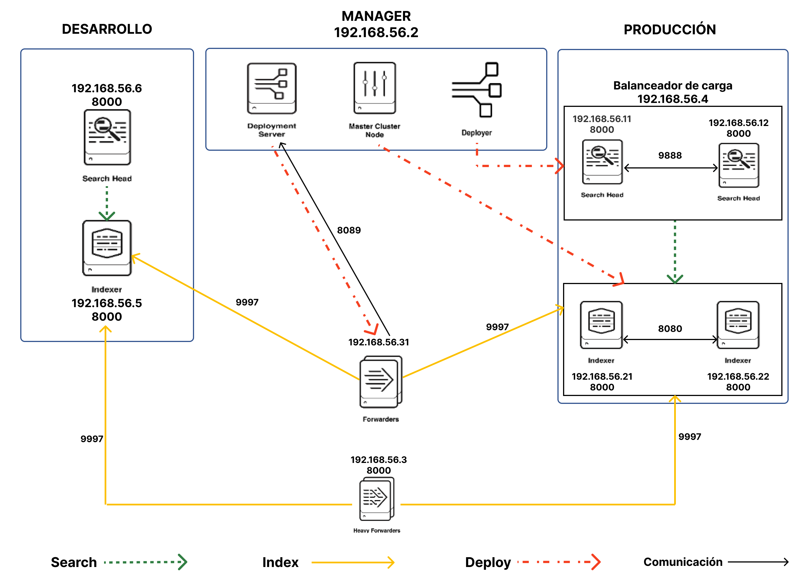

# Splunk Distributed Architecture

## Tabla de contenidos

- [Splunk Distributed Architecture](#splunk-distributed-architecture)
  - [Tabla de contenidos](#tabla-de-contenidos)
  - [Requisitos](#requisitos)
  - [Arquitectura por defecto](#arquitectura-por-defecto)
    - [Arquitectura general](#arquitectura-general)
    - [Arquitectura universal forwarders](#arquitectura-universal-forwarders)
    - [Estructura de los directorios](#estructura-de-los-directorios)
  - [Uso](#uso)
    - [Primera configuración](#primera-configuración)
    - [Usuario y contraseña por defecto de las instancias Splunk](#usuario-y-contraseña-por-defecto-de-las-instancias-splunk)
    - [Levantar arquitectura](#levantar-arquitectura)
      - [Manejo de servidores aprovisionados con Vagrant](#manejo-de-servidores-aprovisionados-con-vagrant)
    - [Manejo de los contenedores Docker dentro de los servidores](#manejo-de-los-contenedores-docker-dentro-de-los-servidores)
    - [Levantar servidores específicos](#levantar-servidores-específicos)
  - [Personalizar la arquitectura por defecto](#personalizar-la-arquitectura-por-defecto)
    - [Añadir indexador al cluster de indexadores de producción](#añadir-indexador-al-cluster-de-indexadores-de-producción)
    - [Añadir miembro al cluster de search heads de producción](#añadir-miembro-al-cluster-de-search-heads-de-producción)
    - [Añadir forwarder](#añadir-forwarder)
    - [Añadir peers al search head de desarrollo](#añadir-peers-al-search-head-de-desarrollo)
    - [Eliminar servidores aprovisionados con Vagrant](#eliminar-servidores-aprovisionados-con-vagrant)
  - [Indexar eventos usando el servidor RabbitMQ de los forwarders](#indexar-eventos-usando-el-servidor-rabbitmq-de-los-forwarders)
    - [Diagrama](#diagrama)
    - [Explicación](#explicación)
  - [Indexación de eventos](#indexación-de-eventos)
    - [Indexar eventos en producción](#indexar-eventos-en-producción)
    - [Indexar eventos en desarrollo](#indexar-eventos-en-desarrollo)
  - [Aliases](#aliases)
  - [Preguntas frecuentes](#preguntas-frecuentes)
  - [Contribuir](#contribuir)
    - [✅ Cambios que se aceptaran](#-cambios-que-se-aceptaran)
    - [❌ Cambios que no se aceptaran](#-cambios-que-no-se-aceptaran)
    - [⬆️ Forma de contribuir](#️-forma-de-contribuir)

## Requisitos

- Tener instalado [Vagrant](https://www.vagrantup.com/) ([instrucciones](https://developer.hashicorp.com/vagrant/tutorials/getting-started/getting-started-install?product_intent=vagrant)).
- Instalar el provider de Docker Compose para Vagrant.

  ``` bash
  vagrant plugin install vagrant-docker-compose
  ```

- Se recomienda utilizar este repositorio en un sistema operativo basado en UNIX ya que su desarrollado se ha realizado en uno basado en el. Cualquier problema en un sistema operativo Windows, por favor, abrir una issue para corregirlo.

## Arquitectura por defecto

### Arquitectura general



Los servidores que se especifican no tienen instalado el software de Splunk, lo que tienen es corriendo un contenedor Docker en modo host con Splunk (salvo los forwarders que tiene un arquitectura mas compleja). Es decir, salvo los forwarders, cada servidor creado con Vagrant compuesta por un contenedor Docker donde se ejecuta una instancia de Splunk con la configuración especifica y necesaria para la función que realiza dentro de la arquitectura. En próximas secciones se enseñara como levantar esta arquitectura.

### Arquitectura universal forwarders


### Estructura de los directorios

``` bash
.
├── common              # Archivos comunes
├── images              # Imágenes para el README
├── lb                  # Balanceador de carga
├── splunk-enterprise   # Core
├── universal-forwarder # Forwarders
```

- common\
  Ficheros comunes utilizados en resto del proyecto.

- images\
  Imágenes utilizadas para crear e README.

- lb (192.168.33.4:80)\
  Balanceador de carga para los search heads de producción.

- splunk-enterprise\
  En este directorio tenemos el Vagrantfile que crea las siguientes piezas de la arquitectura:

  - Master
  - Deployer
  - Deployment Server
  - Indexador de desarrollo
  - Search head de desarrollo
  - Heavy Forwarder
  - Indexadores de producción
  - Search heads de producción

- universal-forwarder\
  Forwarders

## Uso

### Primera configuración

- Configurar las rutas de descarga de Splunk. Para ello debemos de renombrar los ficheros `env.example.rb` a `env.rb`.

  - Splunk Enterprise\
  En la variable `RELEASE_URL`, entre las comillas dobles, debemos asignar la ruta de descarga del paquete .tgz de la version que queramos utilizar de Splunk Enterprise. Solo debemos añadir la parte de la url a partir de "<https://download.splunk.com/products/splunk/releases/>"

  - Splunk Universal Forwarder\
  En la variable `RELEASE_URL`, entre comillas dobles, debemos asignar la ruta de descarga del paquete .tgz de la version que queramos utilizar de Splunk Universal Forwarder. Solo debemos añadir la parte de la url a partir de "<https://download.splunk.com/products/splunk/releases/>"

  Para facilitar la configuración de la variable `RELEASE_URL`, en cada directorio donde hay un archivo llamado `env.example.rb`, hay un archivo llamado `urls.txt` con versiones que otros usuario han subido al repositorio. Para usarlas solo debemos copiar la url de la versión que queramos utilizar del archivo `urls.txt` y asignar se la a la variable `RELEASE_URL` en el archivo `env.rb` que hemos renombrado anteriormente. Si la version de Splunk Enterprise o Splunk Universal Forwarder que buscas no esta en el archivo `urls.txt` correspondiente, crea una Pull Request para incluirla.

  [Página de descargas Splunk Enterprise](https://www.splunk.com/en_us/download/splunk-enterprise.html)\
  [Página de descargas Universal Forwarder](https://www.splunk.com/en_us/download/universal-forwarder.html)

- Configurar imagen base de los contenedores que se crean con el Vagrantfile que hay dentro de la carpeta `splunk-enterprise`. Para configurar la imagen base a partir de la cual se deben crear los contenedores, debemos ir al archivo `splunk-enterprise/env.rb` que hemos creado anteriormente y rellenar la variable `DOCKER_FROM` con la imagen base de Docker que deseemos.
- Configurar los comandos que queramos que se hagan durante la creación de la imagen para los contenedores que se crean con el Vagrantfile que hay dentro de la carpeta `splunk-enterprise` salvo para el Heavy Forwarder (se explica mas tarde como hacer la configuración para esta pieza). Para ello debemos ir al archivo `splunk-enterprise/env.rb` y rellenar la variable `CONTAINER_RUN` con los comandos que queramos que se ejecuten en la construcción de la imagen. Esto es util si por ejemplo necesitamos que en el contenedor este instalado PHP, si la imagen base fuera la de Ubuntu, lo rellenaríamos con `apt install php`. Es importante que los comandos que queramos ejecutar sean compatibles con el OS de la imagen base que hemos elegido. Si no se quiere especificar ninguno dejar el contenido que hay por defecto.
- Configurar los comandos que queremos que se hagan durante la creación de la imagen para el Heavy Forwarder. Para ello debemos ir al archivo `splunk-enterprise/env.rb` y rellenar la variable `CONTAINER_RUN_HF` con los comandos que queramos que se ejecuten en la construcción de la imagen. Esto es util si por ejemplo necesitamos que en el contenedor este instalado PHP, si la imagen base fuera la de Ubuntu, lo rellenaríamos con `apt install php`. Es importante que los comandos que queramos ejecutar sean compatibles con el OS de la imagen base que hemos elegido. Si no se quiere especificar ninguno dejar el contenido que hay por defecto.
- Configurar imagen base del contenedor del Universal Forwarder. Para ello debemos ir al archivo `universal-forwarder/forwarder-compose.yml` y cambiar el valor para el argumento `DOCKER_FROM` del servicio `uf`.
- Configurar los comandos que queremos que se hagan durante la creación de la imagen para el Universal Forwarder. Para ello debemos ir al archivo `universal-forwarder/forwarder-compose.yml` y cambiar el valor para el argumento `CONTAINER_RUN` del servicio `uf`.

### Usuario y contraseña por defecto de las instancias Splunk

Por defecto todas las instancias de Splunk han sido iniciadas con el usuario `admin` y la contraseña `admin1234`. Si se quiere cambiar las credenciales, se deberá modificar el archivo `user-seed.conf`. También se deberán recrear aquellos servidores con instancias de Splunk afectadas.\

### Levantar arquitectura

#### Manejo de servidores aprovisionados con Vagrant

Para manejar los servidores aprovisionados/as con Vagrant revisar la documentación referida a continuación:

- Iniciar un entorno: <https://developer.hashicorp.com/vagrant/tutorials/getting-started/getting-started-up>
- Recrear un entorno: <https://developer.hashicorp.com/vagrant/tutorials/getting-started/getting-started-rebuild>
- Derribar un entorno: <https://developer.hashicorp.com/vagrant/tutorials/getting-started/getting-started-teardown>

***NOTA: Los comandos de Vagrant siempre se deben realizar en el directorio donde se encuentra el Vagranfile. Dependiendo de que parte queramos manejar deberemos realizarlo sobre una carpeta de la raíz del proyecto u otra. [Ver estructura de directorios](#estructura-de-los-directorios)***

### Manejo de los contenedores Docker dentro de los servidores

Para manejar los contenedores dentro de los servidores utilizaremos los comandos habituales de Docker.

En la mayoría de servidores, si ejecutamos `docker ps` solo vamos un contenedor con una instancia de Splunk Enterprise corriendo configurada para operar según su función ([ver arquitectura por defecto](#arquitectura-general)).

En el caso de los forwarders, tendremos tres contenedores corriendo tal y como se explica en la sección [Arquitectura universal forwarders](#arquitectura-universal-forwarders).

### Levantar servidores específicos

| Servidor                                                                  | Comando             | Directorio donde realizarlo |
| ------------------------------------------------------------------------- | ------------------- | --------------------------- |
| Manager                                                                   | vagrant up manager  | splunk-enterprise           |
| Search head desarrollo                                                    | vagrant up test_sh  | splunk-enterprise           |
| Indexador desarrollo                                                      | vagrant up test_idx | splunk-enterprise           |
| Heavy Forwarder                                                           | vagrant up hf       | splunk-enterprise           |
| Balanceador de carga                                                      | vagrant up lb       | lb                          |
| Universal Forwarders especifico                                           | vagrant up uf[num]  | universal-forwarder         |
| Universal Forwarders todos los configurados [Ver como](#añadir-forwarder) | vagrant up          | universal-forwarder         |
| Search head producción                                                    | vagrant up sh[num]  | splunk-enterprise           |
| Indexador producción                                                      | vagrant up idx[num] | splunk-enterprise           |

## Personalizar la arquitectura por defecto

### Añadir indexador al cluster de indexadores de producción

Para añadir un indexador al cluster de indexadores de producción debemos modificar el fichero `indexers.txt` que esta presente en la carpeta `files` dentro de la carpeta `common`. Deberemos añadir a este fichero una línea por cada indexador que queramos añadir al cluster. Este línea debe contener exclusivamente la IP del servidor que debe contener el indexador, precedida por `:`.

### Añadir miembro al cluster de search heads de producción

Para añadir un search head al cluster de search heads de producción debemos modificar el fichero `shcluster_members.txt` que esta presente en la carpeta `files` dentro de la carpeta `common`. Deberemos añadir a este fichero una línea por cada search head que queramos añadir al cluster. Este línea debe contener exclusivamente la IP del servidor que debe contener el search head, precedida por `:`.

### Añadir forwarder

Para añadir un forwarder debemos modificar el fichero `forwarders.txt` que esta presente en la carpeta `files` dentro de la carpeta `common`. Deberemos añadir a este fichero una línea por cada forwarder que queramos añadir. Este línea debe contener exclusivamente la IP del servidor que debe contener el forwarder, precedida por `:`.

### Añadir peers al search head de desarrollo

Por defecto el search head de desarrollo solo busca en el indexador de desarrollo. Si queremos añadir los indexadores de producción deberemos seguir los siguientes pasos:

- Arrancar los indexadores de producción.
- Acceder al search head de desarrollo.
- Ir al directorio bin de Splunk.
- Ejecutar el siguiente comando por cada indexador que queramos añadir como peer al search head de desarrollo:

  ``` bash
  ./splunk add search-server https://<IP-del-indexador>:8089 -auth admin:admin1234 -remoteUsername admin -remotePassword admin1234
  ```

También podemos definirlo directamente en la sección `test-sh` del Dockerfile situado dentro de la carpeta `splunk-enterprise`. El comando añadir sigue la misma estructura que el comentado anteriormente. Por ejemplo, si quiero añadir dos indexadores con las IPs `192.168.33.21` y `192.168.33.22`, el comando `CMD` del Dockerfile quedaría de la siguiente forma:

``` Dockerfile
CMD /usr/local/splunk/bin/splunk start --answer-yes --accept-license --no-prompt \
&& /usr/local/splunk/bin/splunk add search-server https://192.168.33.5:8089 -auth admin:admin1234 -remoteUsername admin -remotePassword admin1234 \
&& /usr/local/splunk/bin/splunk add search-server https://192.168.33.21:8089 -auth admin:admin1234 -remoteUsername admin -remotePassword admin1234 \
&& /usr/local/splunk/bin/splunk add search-server https://192.168.33.22:8089 -auth admin:admin1234 -remoteUsername admin -remotePassword admin1234 \
&& tail -f /dev/null
```

Por ultimo, también podemos modificar el archivo `distsearch.conf` que se encuentra en la carpeta `splunk-enterprise/configs/sh/distsearch.conf`. Tendremos que añadir en el parámetro `servers` de la stanza `distributedSearch` las IPs de los indexadores donde queramos buscar separadas por comas sin espacios. Por defecto esta añadida la IP del indexador de desarrollo.

### Eliminar servidores aprovisionados con Vagrant

Para eliminar un servidor primero debemos ejecutar `vagrant destroy` del servidor y luego borrar la IP del servidor en el archivo .txt correspondiente.

Según que servidor se elimine habrá que recrear los siguientes servidores:
| Servidor eliminado        | Servidores a recrear                                               |
| ------------------------- | ------------------------------------------------------------------ |
| Search head de producción | Recrear load balancer y todos los demás search heads de producción |
| Indexador de producción   | Recrear forwarders y heavy forwarder                               |
| Indexador                 | Borrar IP del archivo `distsearch.conf` si estuviera               |

## Indexar eventos usando el servidor RabbitMQ de los forwarders

### Diagrama


### Explicación

Para enviar eventos al servidor RabbitMQ de los forwarders tenemos dos opciones:

- Enviar eventos manualmente a el servidor RabbitMQ. Cuando digo "manualmente" me refiero usando cURL, un script custom, cualquier software, ...

- Utilizar el script que se proporciona en este repositorio. Este script esta en la carpeta `rabbitmq` dentro de la carpeta `scripts`, dentro de la carpeta `universal-forwarder`. Antes de ejecutar este script debemos cumplir los siguientes requisitos:

  - Renombrar el archivo `.env.example` a `.env` y rellenar la variable `RABBITMQ_SERVER` con la IP del forwarder donde esta ubicado el broker RabbitMQ a donde queremos enviar los eventos generados con el script.

  - Tener instalado en Python 3.

  - Instalar las librerías utilizadas. Para instalar las librerías debemos ejecutar `pip install -r requirements.txt`. Podemos instalar estas librerías y usar la version de Python 3 que tengamos instalada de manera global en el ordenador o crear un entorno virtual. La forma recomendad es crear un entorno virtual. Para crear un entorno virtual en Python podemos utilizar **virtualenv** ([Documentación](https://virtualenv.pypa.io/en/latest/index.html)).

  *Nota: Si se utiliza un entorno virtual, antes de lanzar el comando para ejecutar el script, habrá que activarlo.*

  Una vez cumplidos los requisitos para ejecutar el script simplemente debemos invocarlo con el comando `python send.py`. Al lanzar el comando, el script nos pregunta la `exchange` a la que queremos enviar el mensaje y el propio mensaje que queremos enviar. Si le damos enter a cualquiera de las dos pregunta se aplicaran el valor por defecto para la `exchange` (`my_exchange`) y se genera un mensaje con la estructura por defecto con contenido aleatorio.

Para indexar los eventos que enviamos debemos configurar una `Serverclass` con una aplicación que contenga un monitor hacia el archivo con el nombre de la exchange con los mensajes que queramos indexar. Este archivo tiene la extension `.log` y se encontrara en la carpeta `/tmp`. Ademas deberemos añadir a la `Serverclass` los forwarders a los que queramos desplegar la aplicación, es decir, a los clientes de los que queremos indexar datos.

Para definir la `Serverclass` deberemos ir al master node que se encuentra en el servidor con IP `192.168.33.2` y puerto `8000`.

Para enviar datos a producción o desarrollo, ver la sección siguiente.

## Indexación de eventos

### Indexar eventos en producción

Para enviar datos a producción debemos configurar el parámetro `_TCP_ROUTING` con el valor `pr_group` para cada stanza que queramos que envié los datos los indexadores de producción.

### Indexar eventos en desarrollo

Para enviar datos a desarrollo debemos configurar el parámetro `_TCP_ROUTING` con el valor `de_group` o no configurarlo para cada stanza que queramos que envié los datos al indexador de desarrollo. Por defecto los datos se envían al indexador de desarrollo a no ser que se especifique otra cosa.

## Aliases

Los alias están definidos dentro de las carpetas `splunk-enterprise` y `universal-forwarder` en un fichero con el nombre `.aliases`. En este fichero están definidos aliases para ejecutar en la terminal con el objetivo de simplificar algunas tareas. Para cargar los aliases ejecutar el siguiente comando:

``` bash
source .aliases
```

Los aliases disponibles son los siguientes:

- splunk-enterprise
  - launch_dev: Levanta el servidor con el manager, el servidor con el searchead de desarrollo y el servidor con el indexador de desarrollo.

## Preguntas frecuentes

Para añadir una pregunta nueva crea una issue.

*No hay preguntas de momento*

## Contribuir

### ✅ Cambios que se aceptaran

- Optimizaciones de código
- Mejoras en el manejo de la arquitectura
- Solución a errores a la hora de utilizarla
- Errores o mejoras en el README
- Traducciones en el README
- Mejoras que hagan que a los usuarios les resulte mas fácil utilizar este proyecto
- Actualización de los archivos `urls.txt` con nueva versiones

### ❌ Cambios que no se aceptaran

- Cambios que modifiquen la arquitectura por defecto del proyecto
- Cambios que incluyan información sensible
- Cambios que modifiquen el sentido del proyecto
- Cambios no inclusivos con el usuario de los demás usuarios

### ⬆️ Forma de contribuir

- Hacer fork del proyecto.
- Crear rama con el nombre del cambio.
- Hacer pull request con el cambio desde la rama que hemos creado a la rama main de este repositorio.
